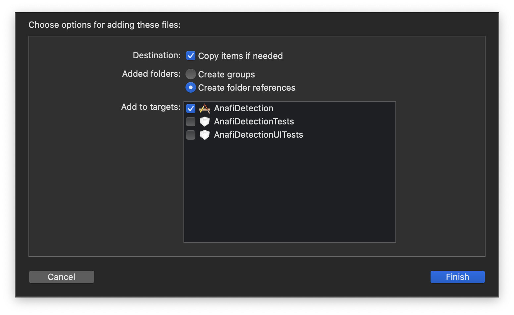

# Parrot Anafi Object Detection Demo
This repository demonstrates how to train, quantize, and deploy a few-shot object detection model 
trained on only 5 rubber-ducky images. We deploy the model on iOS for performing inference on live video captured from the Parrot Anafi drone.

**It is important to note that this is a proof-of-concept and not intended for production.**

## Requirements

* Parrot Anafi Drone
* Xcode 11.7+
* iOS 12.2+

## App Setup

In your Terminal, cd into the ios directory, and run the following commands

```
pod repo update
pod install
```

Once the pods have been installed, you can open the .xcworkspace file and start coding.

## Usage
After running the app on your iPhone, you must connect to the wifi signal broadcast by your Parrot Anafi drone. Tap the table cell with your drone info to connect. After the drone connects, the drone will be kicked into the HUD screen where you can view the live video stream. Detections will be drawn on the screen.

## Object Detection

This app ships with both the trained rubber-ducky detector model, as well as a model trained on the [COCO dataset](https://cocodataset.org/#home). 
By default, the app runs the rubber-ducky model. If you would like to try out the COCO model, you must alter the following in `ModelDataHandler.swift`

```swift
// Replace this 
enum MobileNetSSD {
  static let modelInfo: FileInfo = (name: "ducky", extension: "tflite")
  static let labelsInfo: FileInfo = (name: "ducky_labelmap", extension: "txt")
}
// With this 
enum MobileNetSSD {
  static let modelInfo: FileInfo = (name: "coco", extension: "tflite")
  static let labelsInfo: FileInfo = (name: "coco_labelmap", extension: "txt")
}
```

## Custom Dataset

If you would like to train a custom object detector, you can follow our example colab notebook [few_shot_object_detection_tflite.ipynb](few_shot_object_detection_tflite.ipynb) and try to get it working with your own dataset. Some Machine Learning knowledge will be required here, as the hyperparameters likely need to be tuned. If you decide to go this route, ensure to update the `MobileNetSSD` enum described above with your model and labelmap filenames. When dragging these files into your app, ensure that your app name is selected to Add To Target (shown below)



## Acknowledgements

This repository was heavily influenced by the following:
* https://github.com/riis/parrot
* https://github.com/tensorflow/models/blob/master/research/object_detection/colab_tutorials/eager_few_shot_od_training_tf2_colab.ipynb, 
* https://github.com/tensorflow/examples/tree/master/lite/examples/object_detection/ios

## Contributors

Ian Timmis, itimmis@riis.com
